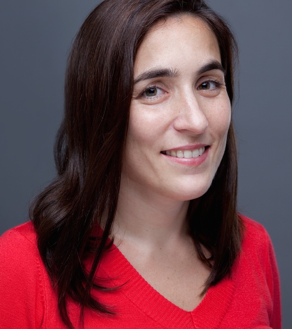
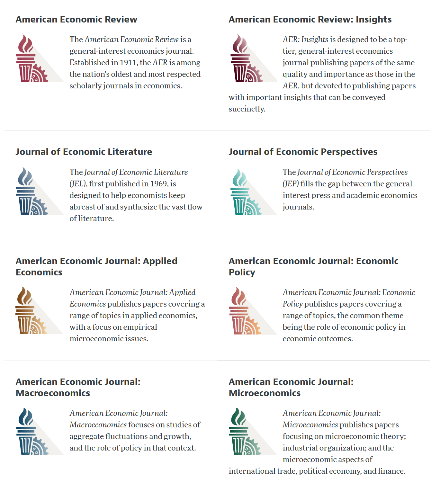
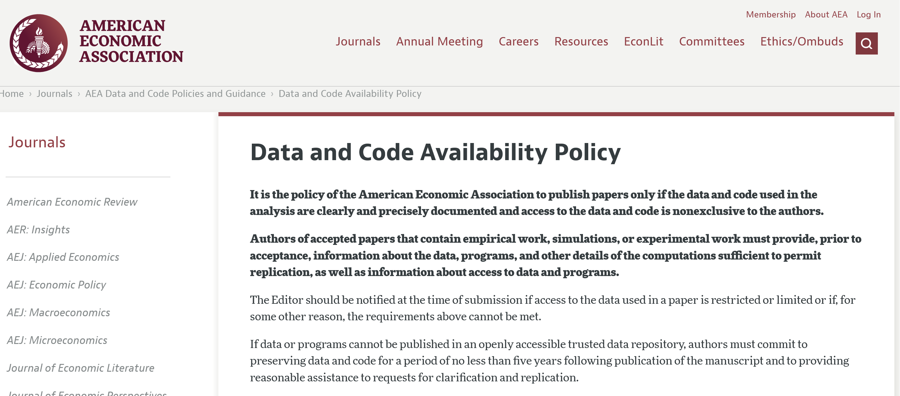

# Qui sommes-nous ?

## Vos instructeurs

::::{.columns}
::: {.column width="50%"}

{width=450px}

:::
::: {.column width="50%"}

{width=450px}

:::
::::

## Marie Connolly {.smaller}

::::{.columns}
::: {.column width="50%"}

Professeure titulaire, Sciences économiques, École des sciences de la gestion (ESG), UQAM. Sa recherche porte sur divers sujets en économie du travail, tels que la mobilité intergénérationnelle des revenus, la formation du capital humain, l'écart entre les sexes et la famille, la participation des femmes au marché du travail et l'évaluation des politiques publiques. Elle est la "Data Editor" de la Revue canadienne d'économique.

:::
::: {.column width="50%"}

:::

::::

## Lars Vilhuber {.smaller}

::::{.columns}

::: {.column width="50%"}

:::

::: {.column width="50%"}

Directeur exécutif du [Labor Dynamics Institute](http://www.ilr.cornell.edu/ldi) et chercheur associé principal au [Département d'économie](http://economics.cornell.edu/) de [Cornell University](http://www.cornell.edu/), et Data Editor de [l'American Economic Association](https://www.aeaweb.org/).

:::

::::

## Éditeur de données de l'AEA

::::{.columns}
::: {.column width="50%"}

2791 manuscrits et 4470 rapports, environ 5000 auteurs contactés.

:::
::: {.column width="50%"}

:::
::::
