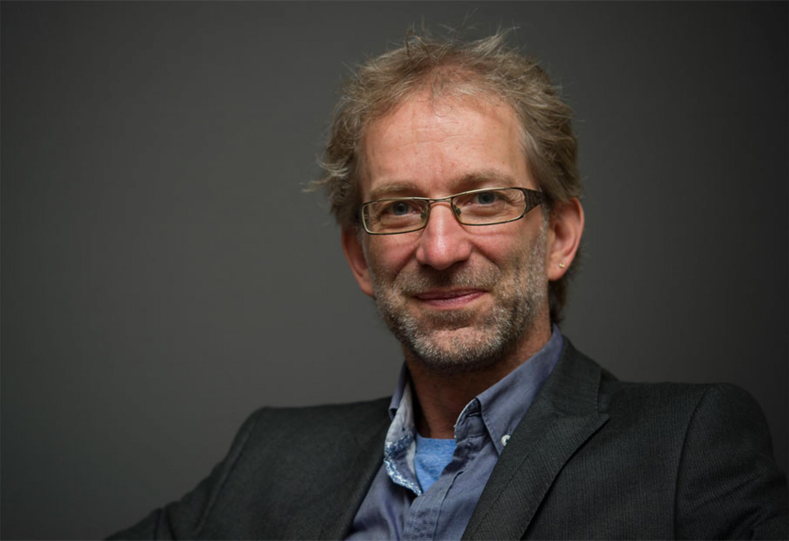

# Qui sommes-nous ?

## Vos instructeurs

::::{.columns}
::: {.column width="50%"}

:::
::: {.column width="50%"}

:::
::::

## Marie Connolly {.smaller}

::::{.columns}
::: {.column width="50%"}

Marie Connolly est professeure titulaire au Département des sciences économiques de l'École des sciences de la gestion (ESG) de l'Université du Québec à Montréal (UQAM). Sa recherche est principalement empirique et porte sur divers sujets en économie du travail, tels que la mobilité intergénérationnelle des revenus, la formation du capital humain, l'écart entre les sexes et la famille, la participation des femmes au marché du travail et l'évaluation des politiques publiques. Elle occupe actuellement le poste d'éditrice des données de la Revue canadienne d'économique.

:::
::: {.column width="50%"}

:::

::::

## Lars Vilhuber {.smaller}

::::{.columns}
::: {.column width="50%"}

Directeur exécutif du [Labor Dynamics Institute](http://www.ilr.cornell.edu/ldi) et chercheur associé principal au [Département d'économie](http://economics.cornell.edu/) de [Cornell University](http://www.cornell.edu/), et Data Editor de [l'American Economic Association](https://www.aeaweb.org/).

:::

::: {.column width="50%"}

:::

::::

## Éditeur de données de l'AEA

::::{.columns}
::: {.column width="50%"}

2389 manuscrits et 4440 rapports, environ 4400 auteurs contactés.

:::
::: {.column width="50%"}

:::
::::
