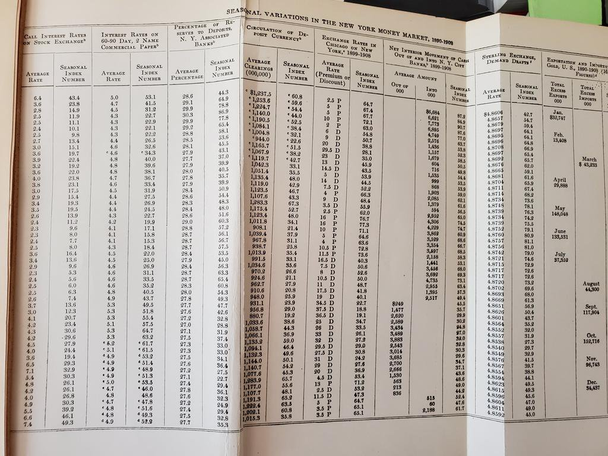
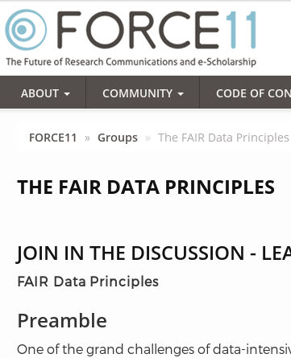
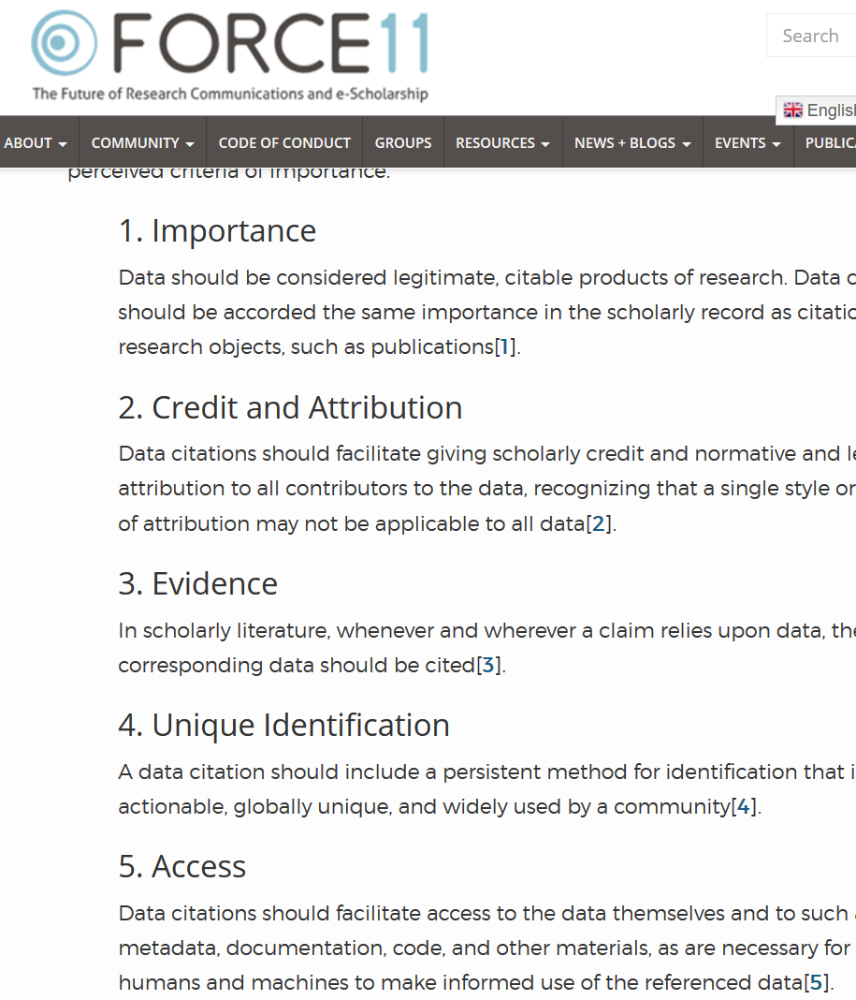

# Meilleures pratiques  {background-image="images/lake-steaming.jpg" background-size="contain" background-position="bottom"}

# D'abord : pourquoi ? {background-image="images/lake-red.jpg" background-size="contain" background-position="bottom"}

## Pourquoi la reproductibilité ?

- Crédibilité
- Transparence (ouverture)
- Efficacité du discours scientifique ?

## Pourquoi la reproductibilité ? {.smaller}

:::: {.columns}

::: {.column width="50%"}

- Les premières publications (20e siècle) *contenaient des tableaux de données*, et les mathématiques étaient simples (peut-être)
- Les données sont devenues électroniques, **n'étaient plus incluses** ou citées
- Les mathématiques ont été transcrites en *code*, et n'étaient *plus incluses*

:::

::: {.column width="50%"}

:::
::::

## Consensus général croissant dans le milieu académique {.smaller}

::::{.columns}

:::{.column width="50%"}

- **Principes FAIR**
- Principes de citation de données
- Reproductibilité computationnelle 

:::

:::{.column width="25%"}

- **F**indable (trouvable)
- **A**ccessible
- **I**nteroperable (interopérable)
- **R**eusable (réutilisable)

:::

:::{.column width="20%"}

:::

::::

## Principes de citation de données {.smaller}

::::{.columns}

:::{.column width="50%"}

- Principes FAIR
- **Principes de citation de données**
- Reproductibilité computationnelle 

:::

:::{.column width="25%"}

- Pour les rendre **trouvables**, *citations*, 
- Donner **attribution** et *crédit* pour les données.

[^dc]

[^dc]:  Data Citation Synthesis Group: Joint Declaration of Data Citation
Principles. Martone M. (ed.) San Diego CA: FORCE11; 2014
<https://www.force11.org/group/joint-declaration-data-citation-principles-final>

:::

:::{.column width="20%"}

:::
::::

## Reproductibilité computationnelle {.smaller}

::::{.columns}

:::{.column width="50%"}

- Principes FAIR
- Principes de citation de données
- **Reproductibilité computationnelle** 

:::

:::{.column width="50%"}

- Sujet principal d'aujourd'hui

> *Reproductibilité* signifie obtenir des résultats computationnels cohérents en utilisant les mêmes données d'entrée, étapes computationnelles, méthodes, code et conditions d'analyse.[^cr]

[^cr]:  National Academies of Sciences, Engineering, and Medicine. 2019. *Reproducibility and Replicability in Science*. Washington, DC: The National Academies Press. <https://doi.org/10.17226/25303>.

:::

::::

