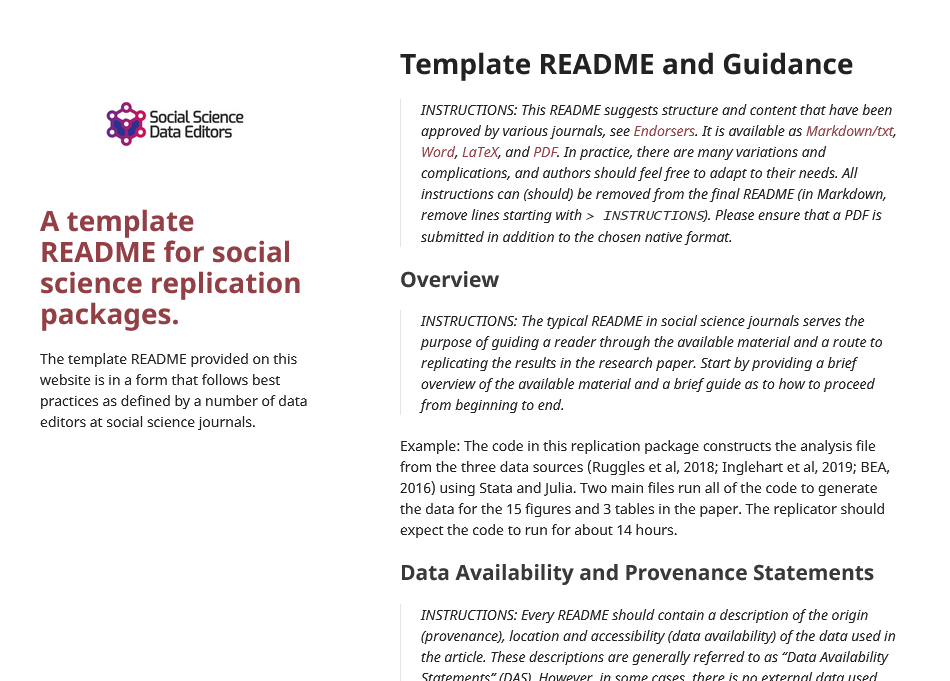
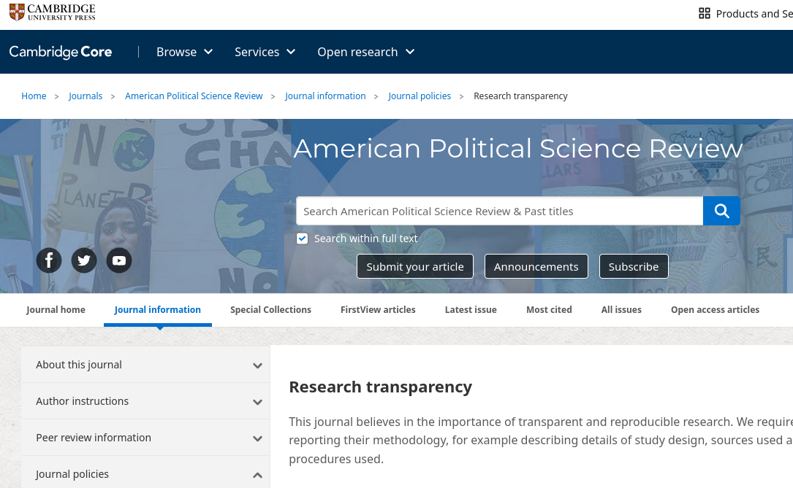
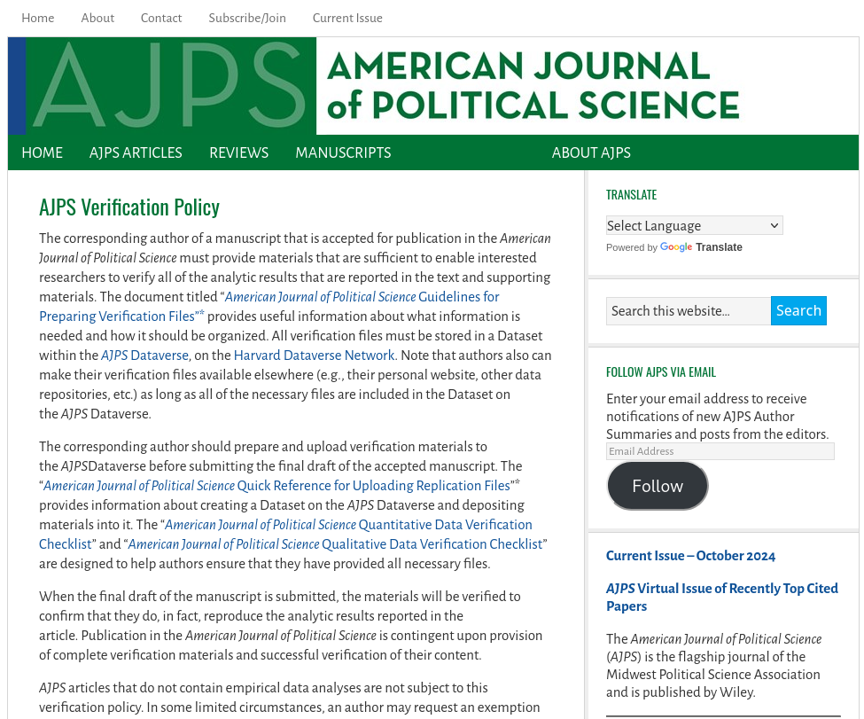
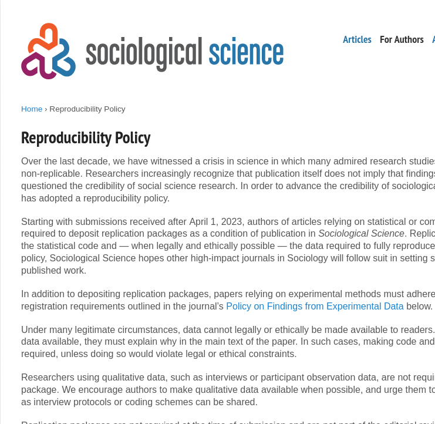
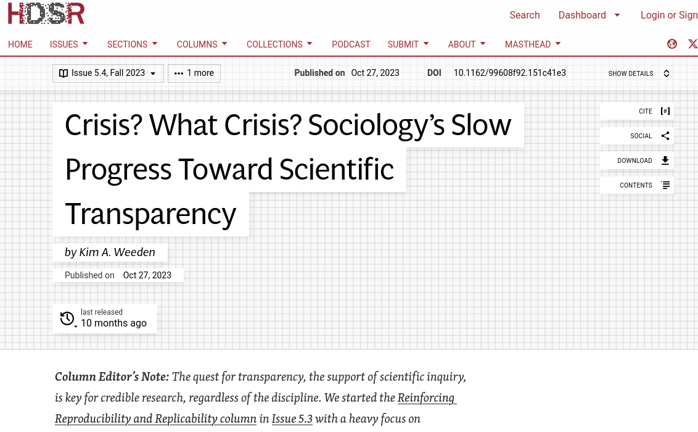

# Détails sur la transparence, etc.

## Transparence

- Provenance des *données*
- Traitement des données, des données brutes aux résultats (code)

> C'est la politique de l'American Economic Association de publier
des articles uniquement si les **données** utilisées dans l'analyse sont **clairement et précisément documentées** et l'**accès** aux données et au code est **clairement et précisément documenté** et n'est pas exclusif aux auteurs.

## Exhaustivité

- Toutes les données doivent être identifiées et l'accès décrit
- Tout le code doit être décrit et fourni 
- Tous les matériaux doivent être fournis (formulaires de sondage, etc.)

> Les auteurs ... doivent fournir, avant l'acceptation, les
**données, programmes et autres détails** des calculs **suffisants** pour
permettre la réplication
 
## Préservation

- Toutes les *données* doivent être préservées pour les futurs réplicateurs
  - Idéalement, dans le paquet de réplication, sous réserve des conditions d'utilisation, pour plus de commodité
  - Sinon, dans un **dépôt de confiance**

## Préservation

- Le *code* doit être dans un dépôt de confiance
  - Habituellement, dans le paquet de réplication
  - Les sites Web, Github, ne sont *pas acceptables*

## Historiquement

## Préservation moderne

 
## Exceptions à la politique

Aucune

## ...

... il y a une zone grise :

- Lorsque les données n'appartiennent pas au chercheur, aucun contrôle sur la préservation, l'accès !
- Parfois, les *conditions d'utilisation* empêchent le chercheur de révéler les métadonnées (nom de l'entreprise, emplacement)

## Transparence encore

- Cependant : 
  - Pas d'exception pour le besoin de **décrire** l'accès (propre et autre)
  - Pas d'exception pour le besoin de **décrire** pleinement le traitement (éventuellement avec du code caviardé)

# Reproductibilité en économie et au-delà

## {background-image="images/socsci-webpage.png" background-size="contain"}

## Éditeurs de données {.smaller}

::::{.columns}

:::{.column width="50%"}

- [American Economic Association](https://www.aeaweb.org/journals/) (8)
- [Econometric Society](https://www.econometricsociety.org/) (3)
- [Revue canadienne d'économique](https://www.economics.ca/cje-home) (1)
- [Royal Economic Society](https://res.org.uk/journals/) (2)
- [Western Economic Association International](https://weai.org/view/EI-Journal-Policies) (1)
- [European Economic Association](http://www.eeassoc.org/journal) (1)
- [Review of Economic Studies](https://www.restud.com/) (1)

:::

:::{.column width="50%"}

:::

::::

## Politiques communes {.smaller}

<https://social-science-data-editors.github.io/>

::::{.columns}

:::{.column width="50%"}

:::

:::{.column width="50%"}

:::

::::

## Ailleurs : Science politique {.smaller}

::::{.columns}

:::{.column width="50%"}

:::

:::{.column width="50%"}

:::

::::

## Ailleurs : Sociologie {.smaller}

::::{.columns}

:::{.column width="50%"}

:::

:::{.column width="50%"}

:::

::::

## Mais !

## Ailleurs : Sociologie {.smaller}

::::{.columns}

:::{.column width="50%"}

:::

:::{.column width="50%"}

 [^hdsr1]

[^hdsr1]:  Weeden, K. A. (2023). Crisis? What Crisis? Sociology's Slow Progress Toward Scientific Transparency  . Harvard Data Science Review, 5(4). <https://doi.org/10.1162/99608f92.151c41e3>

:::

::::
