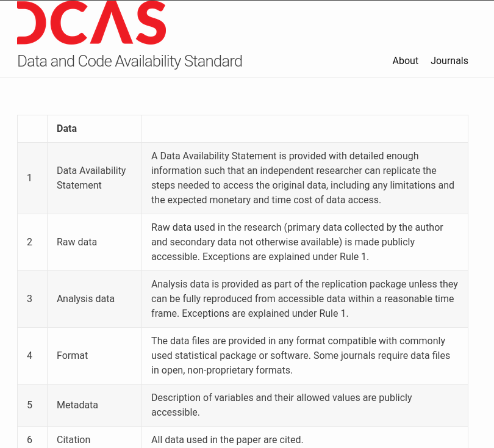
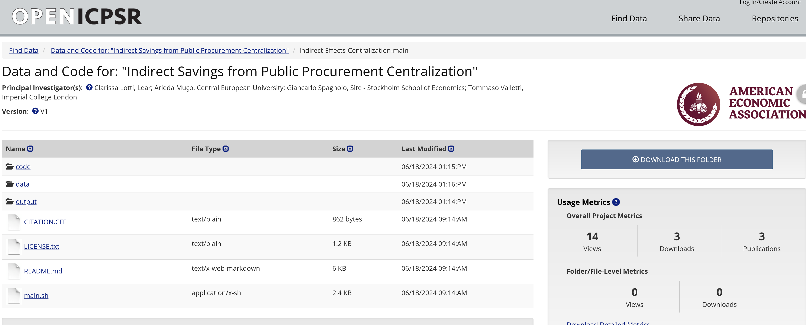

# Qu'est-ce que... {background-image="images/lake-autumn.jpg" background-size="contain" background-position="bottom"}

## Qu'est-ce qu'un paquet de réplication ?

## Un paquet de réplication comprend

- Code
- Données
- Matériaux (pour les sondages, expériences, ...)
- Instructions sur la façon d'obtenir les données non incluses
- Instructions sur la façon de tout combiner
- Problèmes connus documentés

## Conforme à...

- [Politique de disponibilité des données et du code de l'AEA](https://www.aeaweb.org/journals/data/data-code-policy)
- [Norme de disponibilité des données et du code](https://datacodestandard.org/)  [.](index.html#/reproducibility-in-economics-and-beyond)

:::: {.columns}
:::{.column width="50%"}

:::
:::{.column width="50%"}

:::
::::

## Est stocké dans...

:::: {.columns}
:::{.column width="50%"}

- [Dépôt de données et de code de l'AEA](https://www.openicpsr.org/openicpsr/search/aea/studies)
- Autres dépôts de confiance

:::
:::{.column width="50%"}

:::
::::

