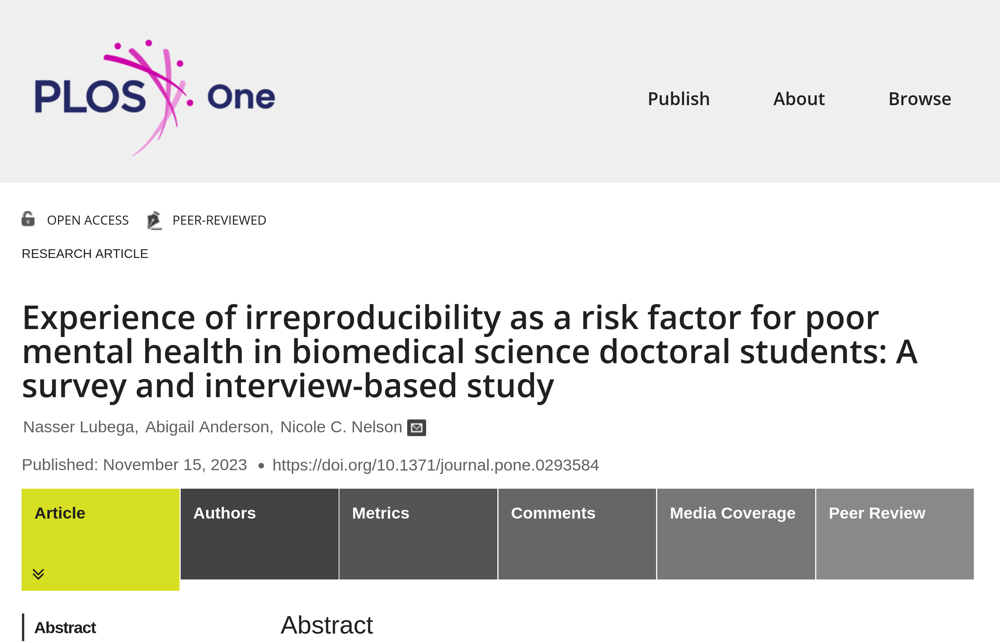

# Meilleures pratiques ? {background-image="images/lake-steaming.jpg" background-size="contain" background-position="bottom"}

## En résumé {.smaller}

::::{.columns}

:::{.column width="50%"}

- **Pourquoi**
  - Crédibilité
  - Transparence (ouverture)
  - Efficacité du discours scientifique ([exemple])
- *Comment*
  - Principes FAIR
  - Principes de citation de données
  - Reproductibilité computationnelle 
:::

:::{.column width="50%"}

- Sous forme de **paquets de réplication**
  - Code
  - Données
  - Matériaux (pour les sondages, expériences, ...)
  - Instructions sur la façon d'obtenir les données non incluses
  - Instructions sur la façon de tout combiner
  - Problèmes connus documentés

:::
::::

# Qui ? {background-image="images/lake-summer.jpg" background-size="contain" background-position="bottom"}

## Qui ?

:::::{.columns}
::::{.column width="50%"}

- 🐇 Auteurs à l'**acceptation conditionnelle** 
- 🐢 Auteurs à la *soumission*
- 🐁 Auteurs au **début** du projet

::::

::::{.column width="50%"}

- 👴🏻👵🏽 Chercheurs expérimentés
- 👶🏽👶🏻 Chercheurs juniors
- 👨‍🎓👩‍🎓 Doctorants
- 🧒👦 Étudiants de premier cycle 

::::
:::::

## Qui ? 

:::::{.columns}
::::{.column width="30%"}

::::

::::{.column width="40%"}

Vous.

::::

::::{.column width="30%"}

::::

:::::

## Vous

:::::{.columns}

::::{.column width="50%"}

👶🏻 Maintenant :

- développement plus efficace
- collaboration plus efficace
- plus d'assurance que "tout fonctionne"

::::

::::{.column width="50%"}

👵🏽 Bientôt

- développement plus efficace entre les projets
- réponse plus efficace aux éditeurs et réviseurs
- ... pendant que vous êtes dans une **nouvelle** institution, sur un *nouvel ordinateur*, avec trois cours à **préparer**, et (luxe !) un **assistant de recherche** à qui vous pouvez déléguer...

::::

:::::

## Vous

