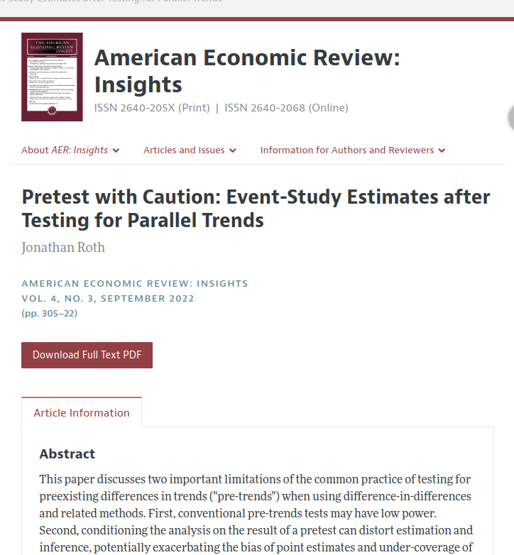
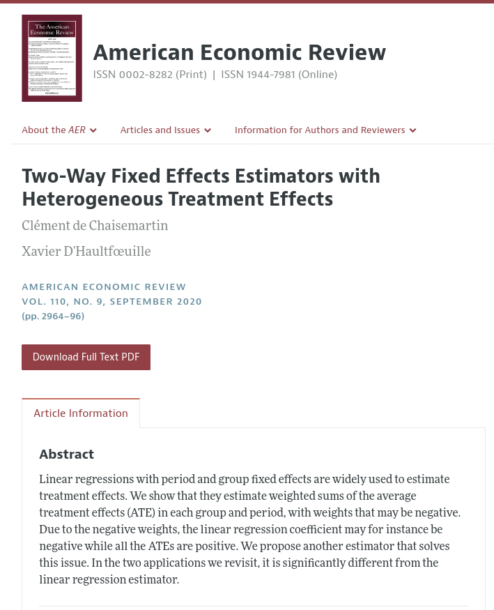

# Avantages

## S'appuyer sur le travail des autres

:::: {.columns}

::: {.column width="60%"}

Roth, Jonathan. 2022. "Pretest with Caution: Event-Study Estimates after Testing for Parallel Trends." American Economic Review: Insights 4 (3): 305–22. DOI: [10.1257/aeri.20210236](https://doi.org/10.1257/aeri.20210236)

Notes : "*J'exclus 43 articles pour lesquels les données pour reproduire le graphique principal de l'étude d'événement n'étaient pas disponibles.*"

:::

::: {.column width="40%"}

:::
::::

## S'appuyer sur le travail des autres : dCdH 2020

:::: {.columns}

::: {.column width="60%"}

de Chaisemartin, Clément, and Xavier D'Haultfœuille. 2020. "Two-Way Fixed Effects Estimators with Heterogeneous Treatment Effects." American Economic Review 110 (9): 2964–96. DOI: [10.1257/aer.20181169](https://doi.org/10.1257/aer.20181169)

Les résultats de divers autres articles sont recalculés pour démontrer empiriquement la pertinence des méthodes proposées.

:::

::: {.column width="40%"}

:::

::::

