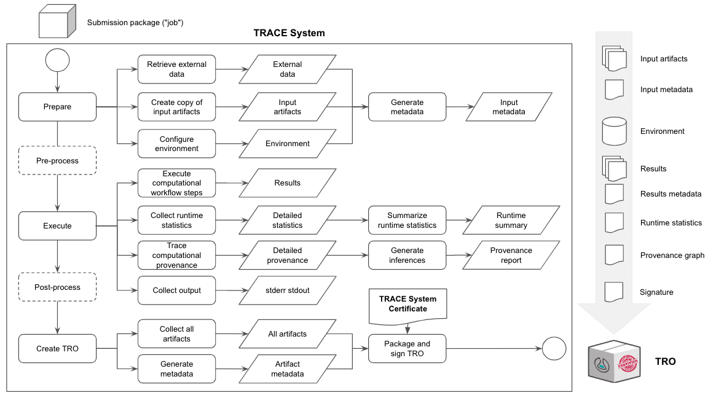

# Transparence ailleurs

## Transparence externalisée

- [Parlez à Limor !](https://dissc.yale.edu/people/limor-peer)
- [R-squared de Cornell](https://socialsciences.cornell.edu/research-support/R-squared)
- [cascad](https://www.cascad.tech/)
- [Banque mondiale](https://doi.org/10.1162/99608f92.21328ce3)

## Transparence externalisée

- Un tiers effectue la reproductibilité, pas vous, pas moi.
- Besoin d'une compréhension commune, de protocoles, etc.
- [Protocole de l'AEA](https://www.aeaweb.org/journals/data/policy-third-party)
- Nous faisons cela environ une douzaine de fois par an

## Transparence externalisée

Pourquoi devrais-je croire le tiers ?

- Confiance
- Transparence
- Méthodes communes

## Transparence certifiée

## Transparence certifiée

- Fournir des informations sur les plateformes informatiques elles-mêmes, y compris des détails spécifiques sur la façon dont la transparence computationnelle est prise en charge.
- Empaqueter et signer les artefacts résultants ainsi que les enregistrements de leur exécution en utilisant un format standard.

## Applications

- Limor, R-squared, cascad, Banque mondiale !
- FSRDC ? IRS ? 
- Métadonnées ?

