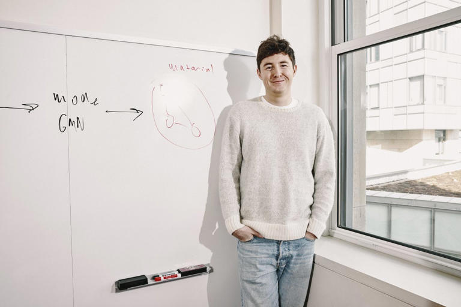
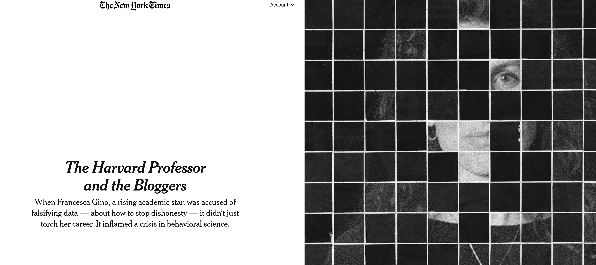
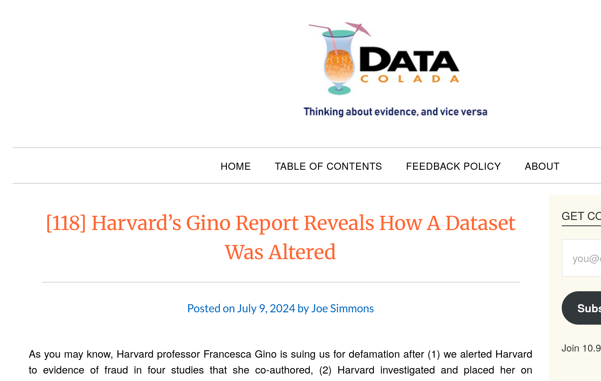
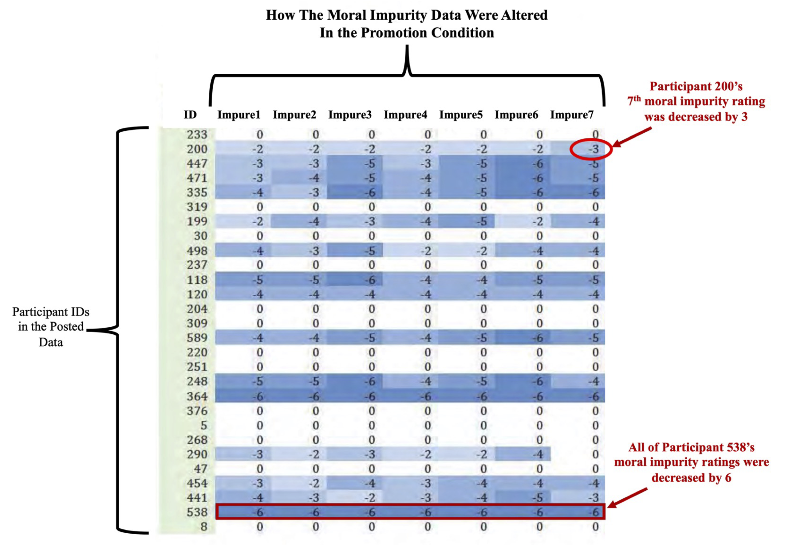
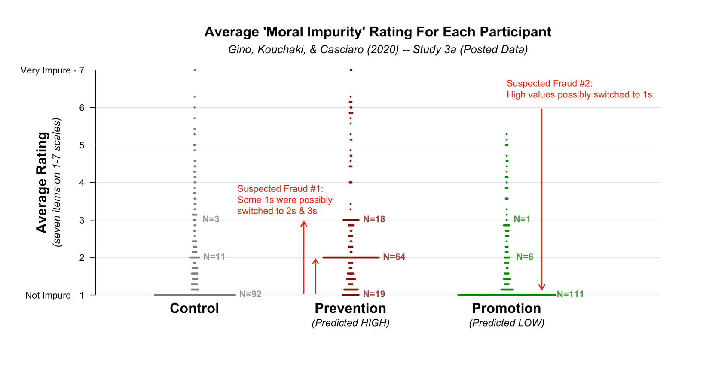

# Provenance

## Qui est cette personne?

## Dirk Smeesters

## Retraction {.smaller}

::::{.columns}  

::: {.column width="10%"}
:::
::: {.column width="80%"}
"a scientific integrity committee found that the results in two of Smeesters’ papers were **statistically highly unlikely**. Smeesters *could not produce the raw data* behind the findings, and told the committee that he **cherry-picked** the data to produce a statistically significant result. Those two papers are being retracted, and the university accepted Smeesters’ *resignation* on June 21 [2012]."

:::
::: {.column width="10%"}
:::
::::

## Qui est cette personne? (2)

## Aidan Toner-Rodgers

## Peut-être en avez-vous entendu parler

::::{.columns}  

::: {.column width="50%"}

::: 
::: {.column width="50%"}

["AI-assisted researchers discover 44% more materials, resulting in a 39% increase in patent filings."](https://www.economist.com/finance-and-economics/2025/05/22/what-the-failure-of-a-superstar-student-reveals-about-economics)

:::
::::

## Aujourd'hui {.smaller}

::::{.columns}  

::: {.column width="10%"}
::: 
::: {.column width="80%"}
"MIT now declares “**no confidence in the provenance**, reliability or validity of the data and...in the veracity of the research”. Mr Toner-Rodgers’s paper has been *withdrawn* from the pre-print repository on which it first appeared [arXiv]; ... The lab at the heart of his findings remains **unknown**." 

:::
::: {.column width="10%"}
:::
::::

# Comment savoir si une source de données est obtenue de manière fiable ?

## Considérons le cas de Gino

## Francesca Gino

- Francesca Gino was a *tenured* professor at Harvard Business School, writing on **honesty** (!)

## Le cas de Gino

- Several articles were investigated by third parties (*Data Colada*, in particular [^colada1]), and found to be **problematic**

::::{.columns}  

::: {.column width="10%"}
:::

::: {.column width="80%"}

:::
::: {.column width="10%"}
:::
::::

[^colada1]: <https://datacolada.org/109>, <https://datacolada.org/110>, <https://datacolada.org/111>, <https://datacolada.org/112>, <https://datacolada.org/114>, <https://datacolada.org/118>

## Le cas de Gino

- Au moins un de ces articles avait des données manipulées **APRÈS** leur collecte, **AVANT** leur analyse.

:::: {.columns}

::: {.column width="50%"}

:::

::: {.column width="50%"}

:::
::::
