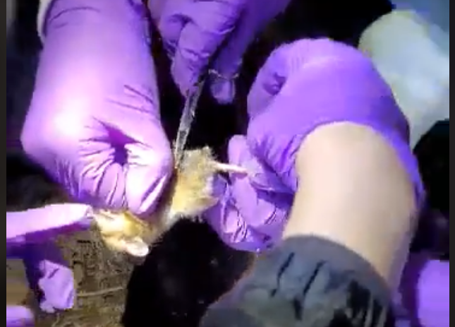
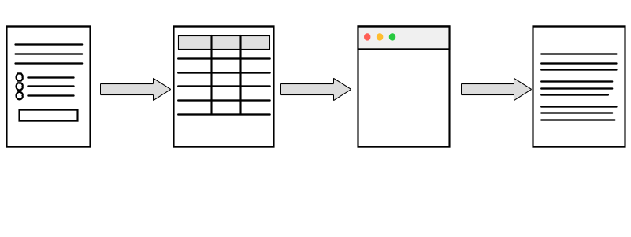
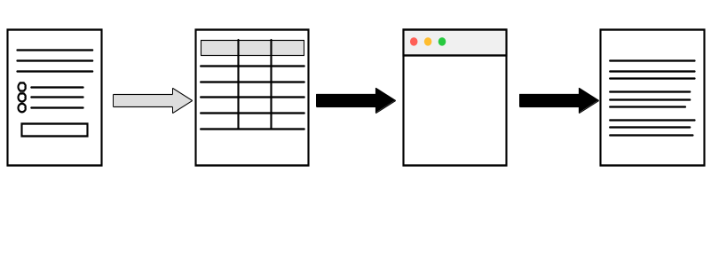
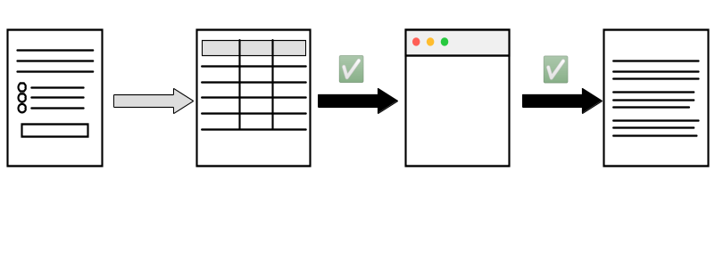
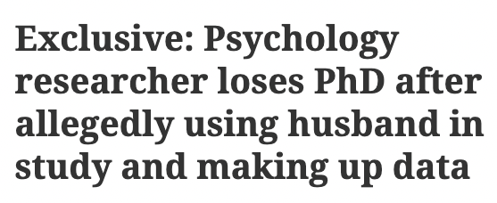
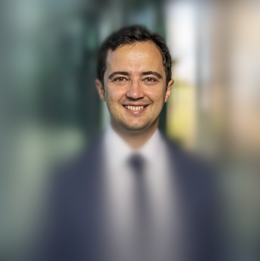

# Que pouvez-**VOUS** faire ?

## Qu'est-ce que c'est ?

## Formation

::::{.columns}
:::{.column width="50%"}

- En biologie, apprentissage de techniques clés
  - Pipetage
  - Capture-recapture d'animaux sauvages

:::
:::{.column width="50%"}
:::
::::

## Formation  {transition="none"}

::::{.columns}
:::{.column width="50%"}

- En biologie, apprentissage de techniques clés
  - Pipetage
  - Capture-recapture d'animaux sauvages

:::
:::{.column width="50%"}

:::
::::

## Flux des données

::: {.white-col}

:::

## Transparence dans l'académie

::: {.white-col}

:::

## Vérifier la transparence

::: {.white-col}

:::

## Vérification par les revues

- **La mise à disposition** (publication des matériaux) fournit la transparence
- **La vérification** (exécuter à nouveau l'analyse - reproductibilité computationnelle) compense la *méfiance*/*absence de confiance*

## Vérification par d'autres

::::{.columns}
:::{.column width="50%"}

- Pré-publication : [cascad](https://www.cascad.tech/)

:::
:::{.column width="50%"}

- Post-publication : [Data Colada](https://datacolada.org/), [Institute for Replication](https://i4replication.org/)

:::
::::

## Vérification par les institutions

::::{.columns}
:::{.column width="50%"}

- [World Bank](https://reproducibility.worldbank.org/index.php/home)[^jones]

[^jones]: Jones, M. (2024). Introducing Reproducible Research Standards at the World Bank. Harvard Data Science Review, 6(4). <https://doi.org/10.1162/99608f92.21328ce3>

:::
:::{.column width="50%"}

:::
::::

## Vérification par vous

::::{.columns}
:::{.column width="50%"}

:::
:::{.column width="50%"}

- Toner-Rodgers: d'autres ont examiné son travail
  - Statistiques (pas trop suspect)
  - Sources (hmmm ?)
  - Cohérence de l'article (beaucoup plus difficile)

:::
::::

## N'empêche pas toute fraude

::::{.columns}
:::{.column width="25%"}
:::
:::{.column width="50%"}

[Un chercheur de Toronto perd son doctorat](https://retractionwatch.com/2024/04/26/psychology-researcher-loses-phd-after-allegedly-using-husband-in-study-and-making-up-data/)

:::
:::{.column width="25%"}

:::
::::

## Comment documenter l'ensemble du processus ?

- Identifier toutes les sources - très précisément !
- Documenter toutes les étapes de traitement - en utilisant les outils que vous apprenez ici !
- Être transparent sur votre processus - montrez votre code !
- Attendez-vous à la critique (sinon à des critiques) - adoptez-la !

## Qui est cette personne ? (3)

::::{.columns}  

::: {.column width="50%"}

::: 
::: {.column width="50%"}

:::
::::

## Qui est cette personne ? (3)

::::{.columns}  

::: {.column width="50%"}

::: 
::: {.column width="50%"}

[Alp Simsek](https://som.yale.edu/faculty-research/faculty-directory/alp-simsek), l'un des ...
:::
::::

## La transparence est la norme

::::{.columns}  

::: {.column width="50%"}

::: 
::: {.column width="50%"}

[près de 5 000 auteurs](https://aeadataeditor.github.io/aea-cumulative-summary/impacts_of_aea_data_editing.html#authors-reached) qui ont vu [leur travail](https://doi.org/10.3886/E159301V1) vérifié par l'AEA Data Editor et son équipe.

:::
::::

