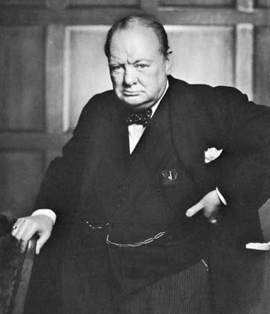
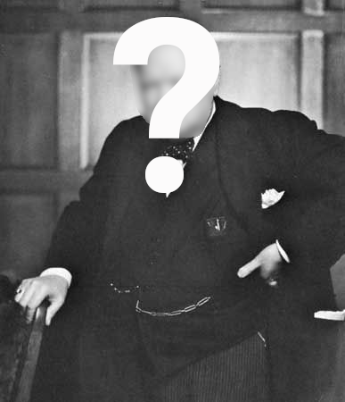

## Churchill a dit...

::::{.columns}
::: {.column width="50%"}

:::
::: {.column width="50%"}
"**Ne faites confiance qu'aux statistiques que vous avez trafiquées vous-même.**"
:::
::::

## Ou l'a-t-il vraiment dit...

::::{.columns}
::: {.column width="50%"}

:::
::: {.column width="50%"}
"Non, bien sûr, le Premier ministre britannique ... **n'a jamais prétendu de telles absurdités**. Mais mettre son nom devant une citation lui donne une apparence plus solennelle, plus imposante, plus définitive." [[Source](https://winstonchurchill.hillsdale.edu/fake-churchill-quote/)]
:::
::::
