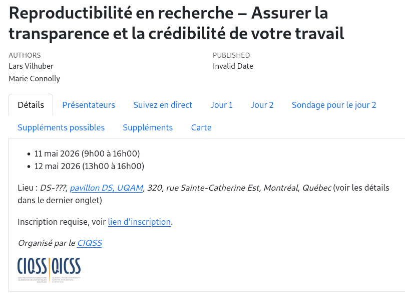
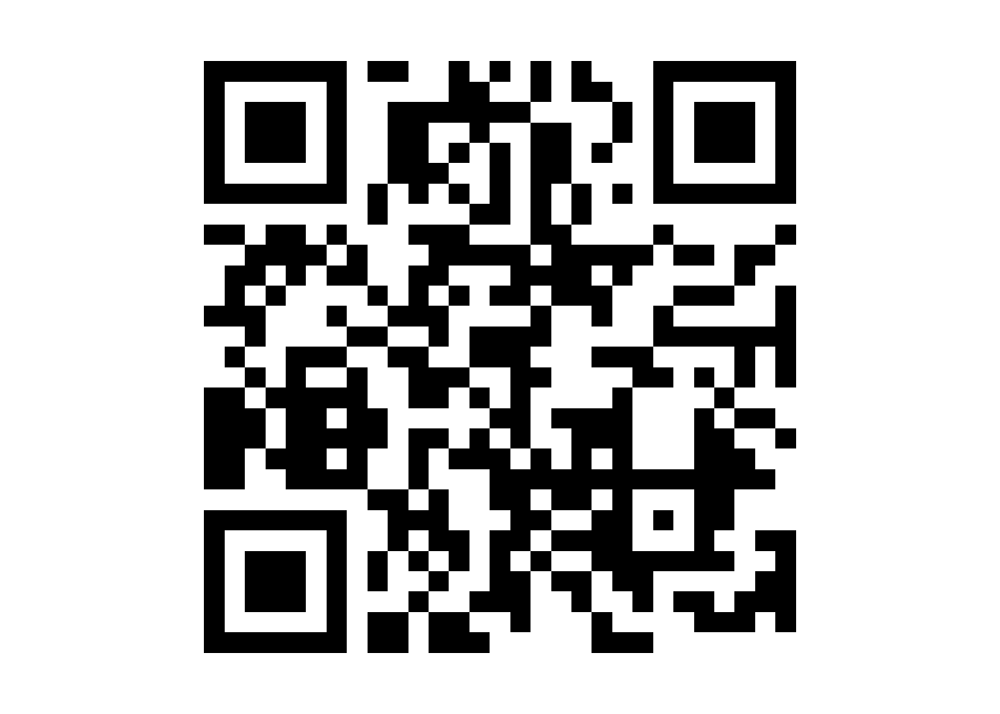

```{r config,include=FALSE}
# The repository name

message(Sys.getenv("GITHUB_REPOSITORY"))

# Process the repository name to generate the URL
# - split the two components
# - combine them into a URL with 'github.io' in the middle

WEBSITE_SUBDIR <- "webinaire"
GITHUB_REPOSITORY <- Sys.getenv("GITHUB_REPOSITORY")
GITHUB_REPOSITORY_PARTS <- strsplit(GITHUB_REPOSITORY, "/")[[1]]
REPOSITORY_URL <- paste0("https://github.com/", GITHUB_REPOSITORY)
WEBSITE_URL <- paste0("https://", GITHUB_REPOSITORY_PARTS[1], ".github.io/", GITHUB_REPOSITORY_PARTS[2], "/", WEBSITE_SUBDIR)

source(here::here(WEBSITE_SUBDIR,'global-libraries.R'))

```


```{r, child=c(here::here(WEBSITE_SUBDIR,'00-qrcode.md'))}
```

```{r, child=c(here::here(WEBSITE_SUBDIR,'00-disclaimer.md'))}
```

```{r, child=c(here::here('presentation','00-whoami.md'))}
```

```{r, child=c(here::here('presentation','01-goal.md'))}
```

```{r, child=c(here::here('presentation','02-reproducibility-extra.md'))}
```

```{r, child=c(here::here(WEBSITE_SUBDIR,'05-fraud.md'))}
```

```{r, child=c(here::here('presentation','10-benefits.md'))}
```

```{r, child=c(here::here(WEBSITE_SUBDIR,'15-what-you-can-do.md'))}
```


```{r, child=c(here::here('presentation','30-how.md'))}
```

# École d'été CIQSS 2026

::::{.columns}
::: {.column width="50%"}



:::
::: {.column width="50%"}



:::
::::


# Merci {background-image="images/lake-autumn.jpg" background-size="contain" background-position="bottom"}


# Appendix


```{r, child=c(here::here('99-links.md'))}
```

